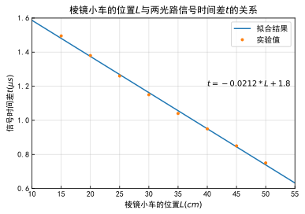

```python
import numpy as np
import matplotlib.pyplot as plt
plt.rcParams['font.sans-serif'] = ['SimHei']
plt.rcParams['axes.unicode_minus'] = False
```


```python
l=[i for i in range(50,14,-5)]
t=[0.750,0.850,0.950,1.040,1.150,1.260,1.380,1.495]
fit=np.polyfit(l,t,1)
x=np.linspace(10,55,1000)
plt.title(r'棱镜小车的位置$L$与两光路信号时间差$t$的关系')
plt.rcParams['xtick.direction'] = 'in'
plt.rcParams['ytick.direction'] = 'in'
plt.ylabel(r'信号时间差$t(\mu s)$')
plt.xlabel(r'棱镜小车的位置$L(cm)$')
plt.xlim(10,55)
plt.ylim(0.6,1.6)
plt.grid(alpha=0.4)
plt.plot(x,np.polyval(fit,x),label='拟合结果')
plt.plot(l,t,'.',label='实验值')
plt.text(40,1.2,s='$'+'t='+'%.3G'%fit[0]+'*L+'+'%.3G'%fit[1]+'$')
plt.legend()
plt.show()
```


    

    


```python

```
