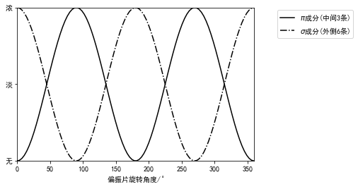

## 实验数据记录
### 不加磁场时
$$
D_{k-1}=\frac{7.792-0.272}{\sqrt{2}}\\
D_k=\frac{5.618-2.322}{\sqrt{2}}
$$
### 加入磁场时
$$
D_b=\frac{6.092-2.440}{\sqrt{2}}\\
D_a=\frac{5.350-3.134}{\sqrt{2}}
$$


```python
dic={}
dic['D_k_1']=(7.792-0.272)/2**0.5/1000
dic['D_k']=(5.618-2.322)/2**0.5/1000
dic['D_b']=(6.092-2.440)/2**0.5/1000
dic['D_a']=(5.350-3.134)/2**0.5/1000
for i in dic:
    print(i,'=','%.4e'%dic[i],'m')
```

    D_k_1 = 5.3174e-03 m
    D_k = 2.3306e-03 m
    D_b = 2.5824e-03 m
    D_a = 1.5669e-03 m
    

$$
标准具间隔圈厚度d=2mm\\
当U=30V时,B=920mT
$$
根据公式
$$
\frac{e}{m}=\frac{2\pi c(D_b^2-D_a^2)}{(M_2g_2-M_1g_1)dB(D_{k-1}^2-D_{k}^2)}
$$


```python
from scipy.constants import pi,c
d=2/1000
B=920/1000
print('d','=','%.4g'%d,'m')
print('B','=','%.4g'%B,'T')
em=2*pi*c*(dic['D_b']**2-dic['D_a']**2)/\
(d*B*(dic['D_k_1']**2-dic['D_k']**2))
print('e/m','=','%.4g'%em,'C/kg')
```

    d = 0.002 m
    B = 0.92 T
    e/m = 1.888e+11 C/kg
    

### 计算得出
$$
\frac{e}{m}=1.888\times10^{11}\ C/kg
$$

### 横向塞曼效应偏振现象观察

|偏振片旋转角度|$\pi$成分(中间3条)|$\sigma$成分(外侧6条)|
|:-:|:-:|:-:|
|$0^\circ$|无|有|
|$30^\circ$|无|有|
|$60^\circ$|有|有|
|$90^\circ$|浓|淡|
|$120^\circ$|浓|淡|
|$150^\circ$|淡|有|
|$180^\circ$|无|有|
|$210^\circ$|无|有|
|$240^\circ$|有|有|
|$270^\circ$|有|无|
|$300^\circ$|有|无|
|$330^\circ$|无|有|


```python
%matplotlib inline
import matplotlib.pyplot as plt
import numpy as np
plt.rcParams['font.sans-serif'] = ['SimHei']
plt.rcParams['axes.unicode_minus'] = False
plt.ylim(0,1)
plt.xlim(0,360)
plt.xlabel('偏振片旋转角度/$^\circ$')
plt.yticks([0,0.5,1],['无','淡','浓'])
x=np.linspace(0,360,100)
y_sigma=0.5+np.cos(x/360*4*pi)/2
y_pi=0.5-np.cos(x/360*4*pi)/2
plt.plot(x,y_pi,'k',label='$\pi$成分(中间3条)')
plt.plot(x,y_sigma,'k-.',label='$\sigma$成分(外侧6条)')
plt.legend(loc=[1.1,0.8])
plt.show()
```





```python

```


```python

```


```python

```
